# WellnessLink — Comprehensive Codebase Analysis

> **Project:** WellnessLink — Clinic Appointment Scheduler  
> **Repository:** `9331-team4_midproject`  
> **Platform:** Java 21 / Maven / Swing / Java RMI  
> **Analysis Date:** March 12, 2026

---

## Table of Contents

1. [Executive Summary](#1-executive-summary)
2. [Product Overview (Product Manager Perspective)](#2-product-overview)
   - 2.1 [Vision & Purpose](#21-vision--purpose)
   - 2.2 [Target Users & Personas](#22-target-users--personas)
   - 2.3 [Feature Inventory](#23-feature-inventory)
   - 2.4 [User Journey Maps](#24-user-journey-maps)
   - 2.5 [Functional Requirements Matrix](#25-functional-requirements-matrix)
   - 2.6 [Business Rules](#26-business-rules)
3. [System Architecture (Software Architect Perspective)](#3-system-architecture)
   - 3.1 [High-Level Architecture](#31-high-level-architecture)
   - 3.2 [Component Diagram](#32-component-diagram)
   - 3.3 [Package Structure](#33-package-structure)
   - 3.4 [Layered Architecture](#34-layered-architecture)
   - 3.5 [Communication Protocol](#35-communication-protocol)
   - 3.6 [Data Architecture](#36-data-architecture)
   - 3.7 [Real-Time Notification System](#37-real-time-notification-system)
   - 3.8 [Concurrency & Thread Safety](#38-concurrency--thread-safety)
   - 3.9 [Design Patterns](#39-design-patterns)
   - 3.10 [Technology Stack](#310-technology-stack)
4. [Codebase Deep Dive (Software Developer Perspective)](#4-codebase-deep-dive)
   - 4.1 [Project Structure](#41-project-structure)
   - 4.2 [Entry Points](#42-entry-points)
   - 4.3 [Network Layer](#43-network-layer)
   - 4.4 [Model Layer](#44-model-layer)
   - 4.5 [Controller Layer](#45-controller-layer)
   - 4.6 [Service Layer](#46-service-layer)
   - 4.7 [Database Layer](#47-database-layer)
   - 4.8 [View Layer](#48-view-layer)
   - 4.9 [Callback System](#49-callback-system)
   - 4.10 [Activity Logging](#410-activity-logging)
   - 4.11 [Request Routing & Action Map](#411-request-routing--action-map)
   - 4.12 [JSON Serialization Strategy](#412-json-serialization-strategy)
5. [Data Flow Analysis](#5-data-flow-analysis)
   - 5.1 [Login Flow](#51-login-flow)
   - 5.2 [Booking Flow](#52-booking-flow)
   - 5.3 [Schedule Creation Flow](#53-schedule-creation-flow)
   - 5.4 [Cancellation Flow](#54-cancellation-flow)
   - 5.5 [Reschedule Flow](#55-reschedule-flow)
6. [Data Model & Storage](#6-data-model--storage)
   - 6.1 [Entity Relationship Diagram](#61-entity-relationship-diagram)
   - 6.2 [JSON Schema Definitions](#62-json-schema-definitions)
   - 6.3 [Data File Inventory](#63-data-file-inventory)
7. [API & Protocol Reference](#7-api--protocol-reference)
   - 7.1 [RMI Interface Contract](#71-rmi-interface-contract)
   - 7.2 [Action Catalog](#72-action-catalog)
   - 7.3 [Response Code Semantics](#73-response-code-semantics)
8. [Evolution History](#8-evolution-history)
9. [Quality Assessment](#9-quality-assessment)
   - 9.1 [Strengths](#91-strengths)
   - 9.2 [Areas for Improvement](#92-areas-for-improvement)
   - 9.3 [Security Considerations](#93-security-considerations)
10. [Metrics & Statistics](#10-metrics--statistics)
11. [Glossary](#11-glossary)

---

## 1. Executive Summary

**WellnessLink** is a desktop client-server clinic appointment scheduling application built in Java 21. It enables **doctors** to manage monthly appointment schedules and **patients** to discover, book, reschedule, and cancel appointments with doctors. The system uses **Java RMI** for client-server communication, **Jackson 3.1.0** for JSON-based data persistence, and **Swing** for the graphical user interface. A real-time **RMI callback** mechanism pushes notifications to connected clients when schedule changes occur.

### Status Lifecycle Update (March 13, 2026)

- Appointment records now use status transitions instead of hard deletion for cancellation workflows.
- New statuses are supported in `ScheduleModel`: `Cancelled` and `Rescheduled` (in addition to `Available` and `Booked`).
- **Mixed Delete Strategy:**
  - **Available** slots (unsold inventory) are now physically removed (Hard Delete) when a doctor deletes them or overrides the day.
  - **Booked (and Rescheduled)** slots are marked as `Cancelled` (Soft Delete) to preserve transaction history.
- Doctor-side booked appointment time updates mark the appointment as `Rescheduled`.
- Patient "My Appointments" dashboard now supports history-style visibility of `Booked`, `Rescheduled`, and `Cancelled` appointments.
- Doctor "Booked Appointments" dashboard now includes both `Booked` and `Rescheduled` appointments for active management.

The codebase comprises **24 Java source files** (~3,500+ lines of code), **3 JSON data files**, and **3 migration documentation files** across a well-organized Maven project structure. The application follows an **MVC (Model-View-Controller)** architectural pattern with a clear separation between presentation, business logic, and data access layers.

---

## 2. Product Overview

### 2.1 Vision & Purpose

WellnessLink is a clinic appointment scheduling platform designed to bridge the gap between healthcare providers (doctors) and patients. It eliminates manual scheduling processes by providing:

- **For Doctors:** Full control over schedule creation, time slot management, and patient appointment oversight
- **For Patients:** Self-service appointment discovery, booking, rescheduling, and cancellation
- **For Both:** Real-time notifications when appointments are modified by the other party

### 2.2 Target Users & Personas

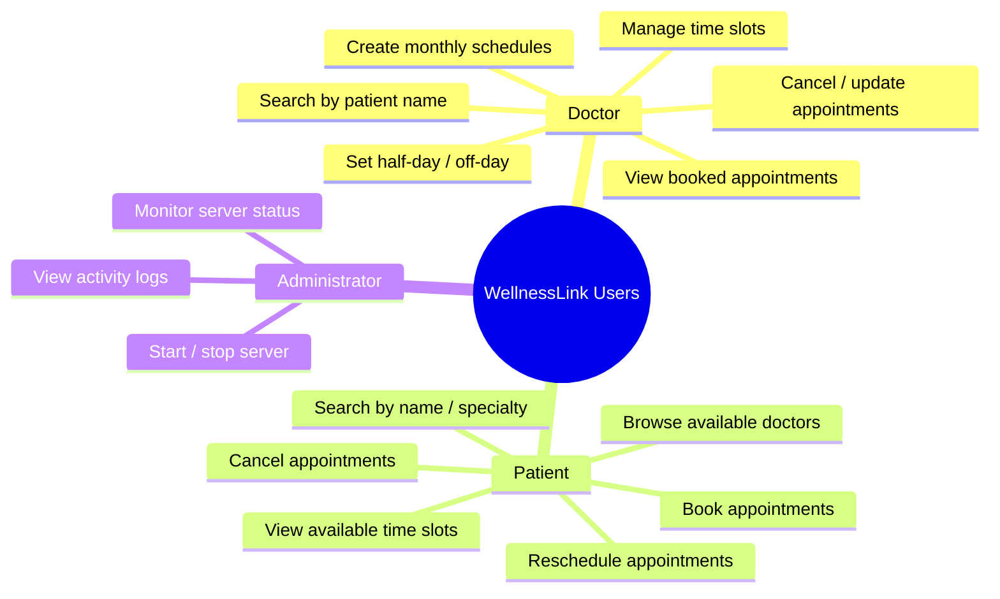

| Persona | Role | Key Actions |
|---------|------|-------------|
| **Doctor** | Healthcare provider | Create schedules, manage slots, override days, view bookings |
| **Patient** | Healthcare consumer | Browse doctors, book/cancel/reschedule appointments |
| **Server Admin** | IT operator | Start/stop server, view activity logs, check server status |

### 2.3 Feature Inventory

#### Doctor Features
| # | Feature | Description | Status |
|---|---------|-------------|--------|
| D1 | Monthly Schedule Creation | Generates slots for each weekday of a month with configurable time ranges and optional Saturday inclusion | Implemented |
| D2 | Schedule Viewing | Table view of all schedule slots (available and booked) sorted by date/time | Implemented |
| D3 | Booked Schedules View | Filtered dialog showing only booked appointments with patient details | Implemented |
| D4 | Slot Time Update | Modify start/end time of an individual slot | Implemented |
| D5 | Half-Day Override | Remove afternoon slots (13:00+) for a specific date | Implemented |
| D6 | Off-Day Override | Remove all available slots for a specific date | Implemented |
| D7 | Slot Deletion | Delete individual available slots (not booked ones) | Implemented |
| D8 | Appointment Search | Search booked appointments by patient name or date | Implemented |
| D9 | Real-Time Notifications | Receive alerts when patients book or cancel appointments | Implemented |

#### Patient Features
| # | Feature | Description | Status |
|---|---------|-------------|--------|
| P1 | Doctor Directory | View all registered doctors with name, specialty, and contact | Implemented |
| P2 | Doctor Search | Filter doctors by name or specialty | Implemented |
| P3 | Available Slots View | Browse available appointment slots for a selected doctor | Implemented |
| P4 | Slot Booking | Book an available appointment slot | Implemented |
| P5 | My Appointments | View all booked appointments | Implemented |
| P6 | Appointment Cancellation | Cancel a booked appointment | Implemented |
| P7 | Appointment Rescheduling | Cancel current and book a new slot in a single operation | Implemented |
| P8 | Real-Time Notifications | Receive alerts when doctors modify or cancel appointments | Implemented |

#### System Features
| # | Feature | Description | Status |
|---|---------|-------------|--------|
| S1 | User Authentication | Username/password login | Implemented |
| S2 | User Registration | Self-service account creation for doctors and patients | Implemented |
| S3 | Activity Logging | JSON-based audit trail of all system events | Implemented |
| S4 | Server CLI | Interactive start/stop/log/status commands | Implemented |

### 2.4 User Journey Maps

#### Doctor Journey

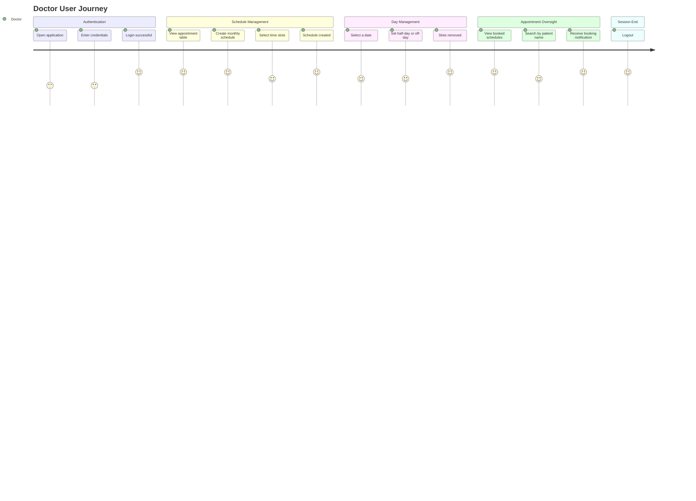

#### Patient Journey

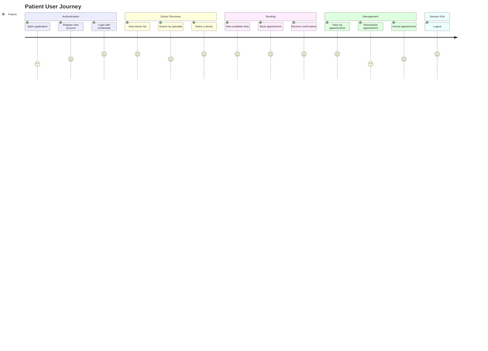

### 2.5 Functional Requirements Matrix

| Requirement | Actor | Priority | Implementation |
|-------------|-------|----------|----------------|
| **FR-001:** Users must be able to register as doctor or patient | All | Critical | `AuthService.register()` → `JsonDatabase.register()` |
| **FR-002:** Users must authenticate before accessing features | All | Critical | `AuthService.login()` → `JsonDatabase.authenticate()` |
| **FR-003:** Doctors can create monthly schedules with configurable slots | Doctor | High | `ScheduleService.createSchedule()` → `JsonDatabase.createMonthlySchedule()` |
| **FR-004:** Doctors can set half-day or off-day overrides | Doctor | Medium | `ScheduleService.overrideDay()` → `JsonDatabase.overrideDay()` |
| **FR-005:** Doctors can delete individual available slots | Doctor | Medium | `ScheduleService.deleteSlot()` → `JsonDatabase.deleteSlotById()` |
| **FR-006:** Doctors can update slot times | Doctor | Medium | `ScheduleService.updateSlot()` → `JsonDatabase.updateSlotTime()` |
| **FR-007:** Patients can browse and search doctors | Patient | High | `ScheduleService.getDoctors()` → `JsonDatabase.getAllDoctors()` |
| **FR-008:** Patients can view available appointment slots | Patient | High | `ScheduleService.getAvailableSlots()` → `JsonDatabase.getAvailableSlots()` |
| **FR-009:** Patients can book available slots | Patient | Critical | `ScheduleService.bookSlot()` → `JsonDatabase.bookSlot()` |
| **FR-010:** Patients can cancel booked appointments | Patient | High | `ScheduleService.cancelBooking()` → `JsonDatabase.cancelBooking()` |
| **FR-011:** Patients can reschedule appointments | Patient | Medium | `PatientController.reschedule()` (cancel + rebook) |
| **FR-012:** Both parties receive real-time notifications | All | High | `CallbackManager.notifyUser()` → `ClinicCallback.onNotification()` |
| **FR-013:** All actions are logged with timestamps | System | Medium | `ActivityLogger.log()` |

### 2.6 Business Rules

| Rule ID | Description | Enforcement Location |
|---------|-------------|----------------------|
| **BR-001** | A booked slot cannot be deleted from the main schedule view | `DoctorController.validateSlotDeletion()` |
| **BR-002** | A booked slot's time cannot be updated by the doctor | `DoctorController.validateSlotTimeUpdate()` |
| **BR-003** | Schedules cannot be created for past months | `DoctorView.createSchedule()` — UI validation |
| **BR-004** | Duplicate slots (same doctor, date, start time) are prevented | `JsonDatabase.slotExists()` |
| **BR-005** | Only the patient who booked a slot can cancel it | `JsonDatabase.cancelBooking()` — patientId check |
| **BR-006** | Sundays are always excluded from schedule generation | `JsonDatabase.createMonthlySchedule()` |
| **BR-007** | Saturdays are excluded by default (opt-in via checkbox) | `JsonDatabase.createMonthlySchedule()` |
| **BR-008** | Usernames must be unique across the system | `JsonDatabase.register()` |
| **BR-009** | Half-day removes only afternoon slots (13:00+) | `JsonDatabase.overrideDay()` |
| **BR-010** | Off-day removes only available (not booked) slots | `JsonDatabase.overrideDay()` |
| **BR-011** | Reschedule is atomic — if re-booking fails, old booking is restored | `PatientController.reschedule()` |

---

## 3. System Architecture

### 3.1 High-Level Architecture

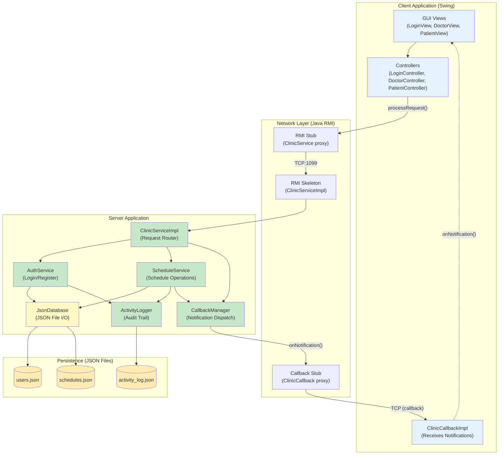

### 3.2 Component Diagram

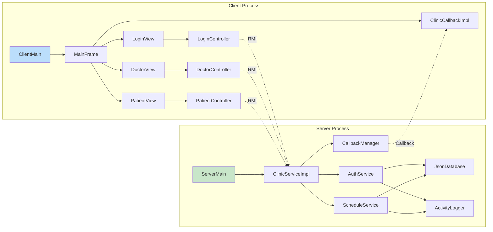

### 3.3 Package Structure

```mermaid
graph TD
    ROOT["src/main/java"]
    ROOT --> PKG_MAIN["(default) MainFrame.java"]
    ROOT --> PKG_CLIENT["client/"]
    ROOT --> PKG_CONTROLLER["controller/"]
    ROOT --> PKG_DATABASE["database/"]
    ROOT --> PKG_MODEL["model/"]
    ROOT --> PKG_NET["net/"]
    ROOT --> PKG_SERVER["server/"]
    ROOT --> PKG_VIEW["view/"]

    PKG_CLIENT --> C1["ClientMain.java"]
    PKG_CLIENT --> C2["ClinicCallbackImpl.java"]

    PKG_CONTROLLER --> CT1["LoginController.java"]
    PKG_CONTROLLER --> CT2["DoctorController.java"]
    PKG_CONTROLLER --> CT3["PatientController.java"]

    PKG_DATABASE --> D1["JsonDatabase.java"]

    PKG_MODEL --> M1["UserModel.java"]
    PKG_MODEL --> M2["ScheduleModel.java"]
    PKG_MODEL --> M3["LoginModel.java"]
    PKG_MODEL --> M4["RegisterModel.java"]
    PKG_MODEL --> M5["ActionResult.java"]
    PKG_MODEL --> M6["ScheduleResult.java"]
    PKG_MODEL --> M7["UserListResult.java"]

    PKG_NET --> N1["ClinicService.java"]
    PKG_NET --> N2["ClinicCallback.java"]
    PKG_NET --> N3["Request.java"]
    PKG_NET --> N4["Response.java"]

    PKG_SERVER --> S1["ServerMain.java"]
    PKG_SERVER --> S2["ClinicServiceImpl.java"]
    PKG_SERVER --> S3["AuthService.java"]
    PKG_SERVER --> S4["ScheduleService.java"]
    PKG_SERVER --> S5["CallbackManager.java"]
    PKG_SERVER --> S6["ActivityLogger.java"]

    PKG_VIEW --> V1["LoginView.java"]
    PKG_VIEW --> V2["DoctorView.java"]
    PKG_VIEW --> V3["PatientView.java"]
    PKG_VIEW --> V4["NavigationHandler.java"]

    style ROOT fill:#e0e0e0
    style PKG_CLIENT fill:#bbdefb
    style PKG_CONTROLLER fill:#c8e6c9
    style PKG_DATABASE fill:#fff9c4
    style PKG_MODEL fill:#f3e5f5
    style PKG_NET fill:#ffe0b2
    style PKG_SERVER fill:#c8e6c9
    style PKG_VIEW fill:#bbdefb
```

### 3.4 Layered Architecture

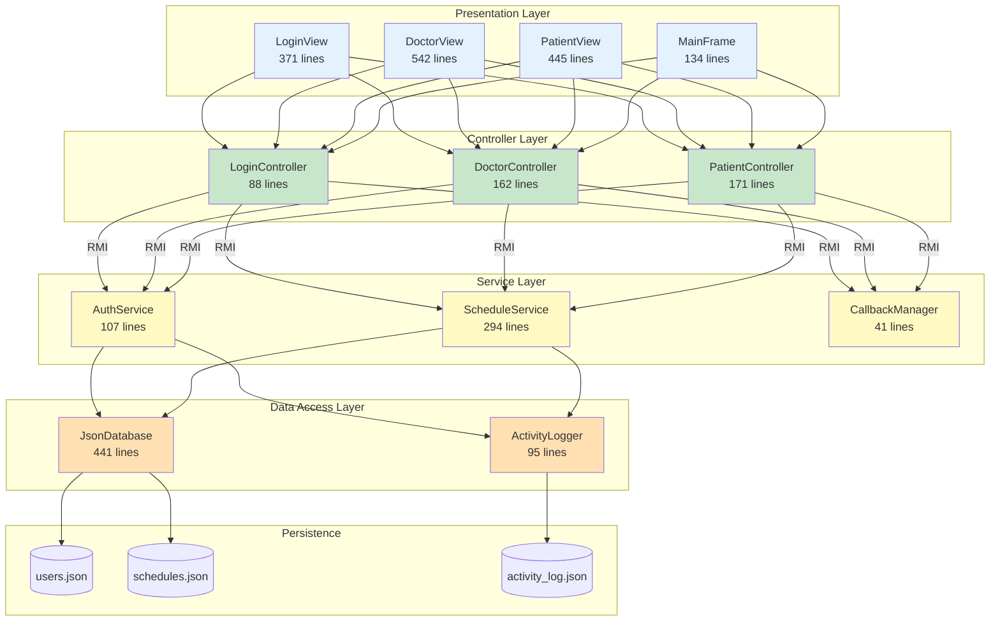

The architecture follows a strict **four-layer** model:

| Layer | Responsibility | Packages |
|-------|---------------|----------|
| **Presentation** | Swing GUI, user interaction, form validation | `view/`, `MainFrame` |
| **Controller** | Request construction, JSON parsing, response mapping | `controller/` |
| **Service** | Business logic, data orchestration, notifications | `server/` (AuthService, ScheduleService, CallbackManager) |
| **Data Access** | JSON file I/O, CRUD operations, query logic | `database/`, `server/ActivityLogger` |

### 3.5 Communication Protocol

The system uses a **Request-Response protocol over Java RMI**:

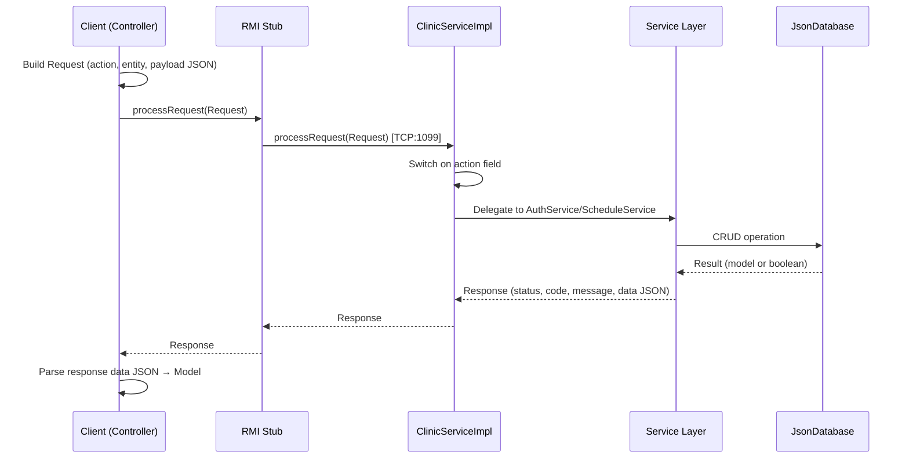

**Request structure:**
```
Request {
  action:  "LOGIN" | "REGISTER" | "CREATE_SCHEDULE" | ... (14 actions)
  entity:  "user" | "schedule"
  userId:  String (caller ID, optional for some actions)
  payload: String (JSON-encoded parameters)
}
```

**Response structure:**
```
Response {
  status:  "success" | "error"
  code:    200 | 201 | 400 | 401 | 404 | 409 | 500
  message: String (human-readable)
  data:    String (JSON-encoded result, optional)
}
```

### 3.6 Data Architecture

The system uses **flat JSON files** as its persistence layer — no relational database. All data access is synchronized at the `JsonDatabase` level to prevent concurrent modification issues.

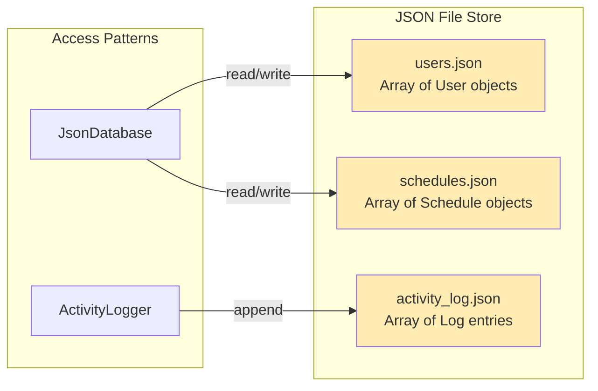

**Key characteristics:**
- **Full-file reads/writes:** Every operation loads the entire JSON array, modifies it in memory, and writes it back
- **Synchronized methods:** All `JsonDatabase` public methods are `synchronized` to prevent data races
- **ID generation:** UUID-based with role prefixes (`DOC-`, `PAT-`, `SCH-`)
- **No indexing:** Linear scans for lookups — acceptable for small datasets

### 3.7 Real-Time Notification System

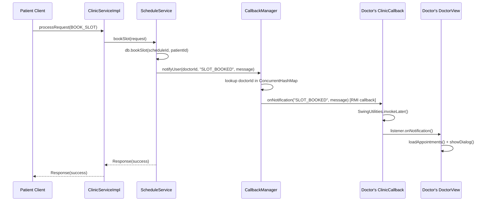

**Notification Events:**

| Event | Trigger | Recipient | Message |
|-------|---------|-----------|---------|
| `SLOT_BOOKED` | Patient books a slot | Doctor | "A patient has booked your slot on {date} ({time})" |
| `BOOKING_CANCELLED` | Patient cancels a booking | Doctor | "A patient has cancelled the appointment on {date} ({time})" |
| `SLOT_UPDATED` | Doctor changes a booked slot's time | Patient | "Your appointment on {date} has been rescheduled to {time}" |
| `SLOT_DELETED` | Doctor deletes a booked slot | Patient | "Your appointment on {date} ({time}) has been cancelled by the doctor" |

### 3.8 Concurrency & Thread Safety

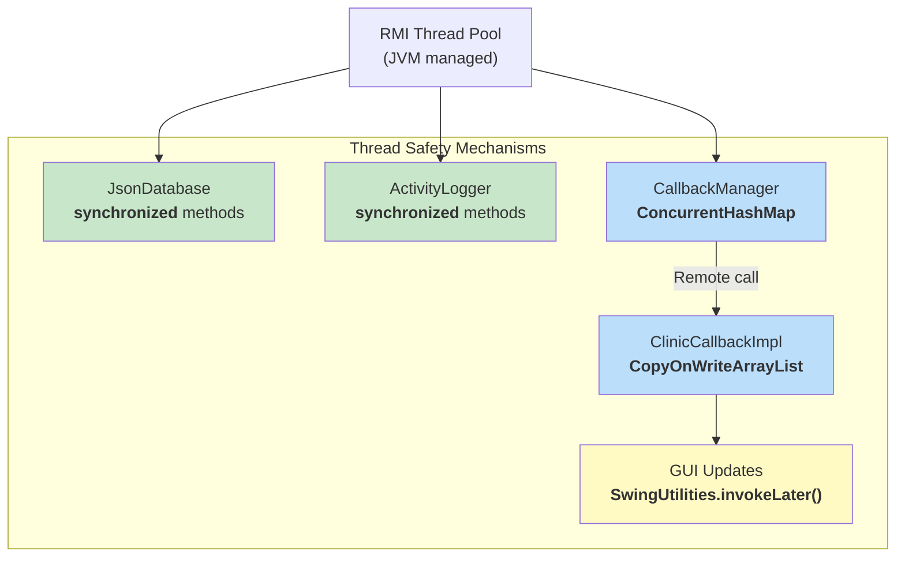

| Component | Mechanism | Purpose |
|-----------|-----------|---------|
| `JsonDatabase` | `synchronized` on every public method | Prevents concurrent file reads/writes from corrupting data |
| `ActivityLogger` | `synchronized log()` and `printLog()` | Ensures log entries are written atomically |
| `CallbackManager` | `ConcurrentHashMap` | Thread-safe client registration without blocking other operations |
| `ClinicCallbackImpl` | `CopyOnWriteArrayList` for listeners | Safe iteration while listeners may be added/removed |
| GUI updates | `SwingUtilities.invokeLater()` | Ensures all Swing component updates happen on the EDT |

### 3.9 Design Patterns

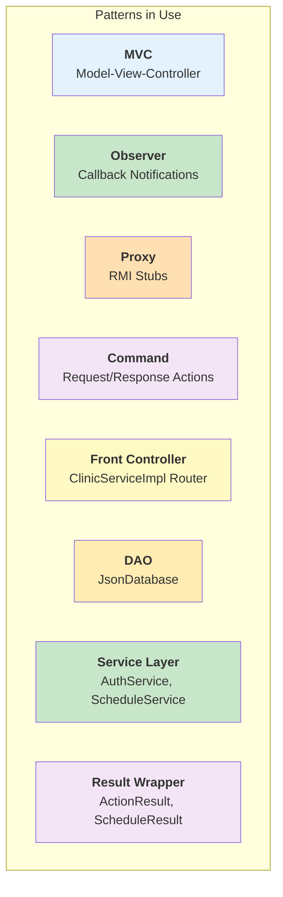

| Pattern | Implementation | Description |
|---------|---------------|-------------|
| **MVC** | Views → Controllers → Models | Clean separation of UI, logic, and data |
| **Observer** | `ClinicCallbackImpl` + `NotificationListener` | Clients subscribe to server events and react to notifications |
| **Proxy** | RMI auto-generated stubs | Transparent remote method invocation |
| **Command** | `Request.action` field + switch routing | Each action is a self-contained command with parameters |
| **Front Controller** | `ClinicServiceImpl.processRequest()` | Single entry point routing all requests |
| **DAO** | `JsonDatabase` | Encapsulates all data access logic |
| **Service Layer** | `AuthService`, `ScheduleService` | Business logic separated from routing and data access |
| **Result Wrapper** | `ActionResult`, `ScheduleResult`, `UserListResult` | Uniform result objects for controller-to-view communication |

### 3.10 Technology Stack

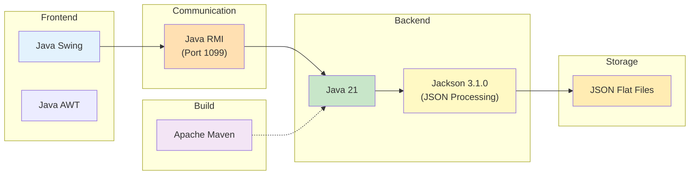

| Technology | Version | Purpose |
|-----------|---------|---------|
| **Java** | 21 | Runtime platform |
| **Maven** | — | Build and dependency management |
| **Java Swing** | — | Desktop GUI framework |
| **Java RMI** | — | Client-server communication |
| **Jackson** | 3.1.0 (`tools.jackson`) | JSON serialization/deserialization |
| **JSON Files** | — | Persistent data storage |

---

## 4. Codebase Deep Dive

### 4.1 Project Structure

```
9331-team4_midproject/
├── pom.xml                           # Maven build config (Java 21, Jackson 3.1.0)
├── 9331-team4_midproject.iml         # IntelliJ IDEA module file
├── rmi-callback-implementation.md    # RMI callback migration docs
├── socket-to-rmi-migration.md        # Socket → RMI migration docs
├── xml-to-json-migration.md          # XML → JSON migration docs
├── src/
│   └── main/
│       ├── java/
│       │   ├── MainFrame.java                  # App frame & navigation
│       │   ├── client/
│       │   │   ├── ClientMain.java             # Client entry point
│       │   │   └── ClinicCallbackImpl.java     # RMI callback receiver
│       │   ├── controller/
│       │   │   ├── LoginController.java        # Auth request handling
│       │   │   ├── DoctorController.java       # Doctor feature requests
│       │   │   └── PatientController.java      # Patient feature requests
│       │   ├── database/
│       │   │   └── JsonDatabase.java           # JSON file data access
│       │   ├── model/
│       │   │   ├── ActionResult.java           # Write operation result
│       │   │   ├── LoginModel.java             # Login form + result
│       │   │   ├── RegisterModel.java          # Registration form + result
│       │   │   ├── ScheduleModel.java          # Schedule/appointment entity
│       │   │   ├── ScheduleResult.java         # Schedule list result
│       │   │   ├── UserListResult.java         # User list result
│       │   │   └── UserModel.java              # User entity
│       │   ├── net/
│       │   │   ├── ClinicCallback.java         # Remote callback interface
│       │   │   ├── ClinicService.java          # Remote service interface
│       │   │   ├── Request.java                # RMI request DTO
│       │   │   └── Response.java               # RMI response DTO
│       │   ├── server/
│       │   │   ├── ServerMain.java             # Server entry point + CLI
│       │   │   ├── ClinicServiceImpl.java      # RMI service implementation
│       │   │   ├── AuthService.java            # Authentication service
│       │   │   ├── ScheduleService.java        # Schedule business logic
│       │   │   ├── CallbackManager.java        # Client callback registry
│       │   │   └── ActivityLogger.java         # Audit log writer
│       │   └── view/
│       │       ├── LoginView.java              # Login + registration UI
│       │       ├── DoctorView.java             # Doctor dashboard UI
│       │       ├── PatientView.java            # Patient dashboard UI
│       │       └── NavigationHandler.java      # Navigation interface
│       └── resources/
│           ├── users.json                      # User data store
│           ├── schedules.json                  # Schedule data store
│           └── activity_log.json               # Activity audit log
└── target/                                     # Maven build output
```

### 4.2 Entry Points

The application has **two separate entry points** — one for the server and one for the client:

#### Server Entry Point: `server.ServerMain.main()`

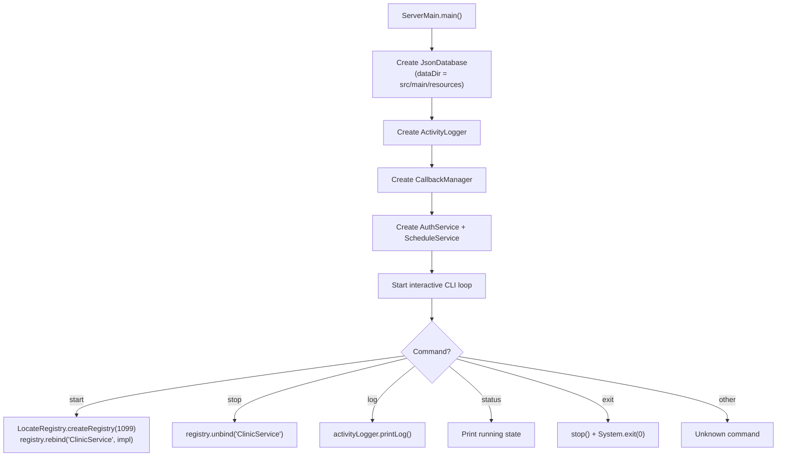

#### Client Entry Point: `client.ClientMain.main()`

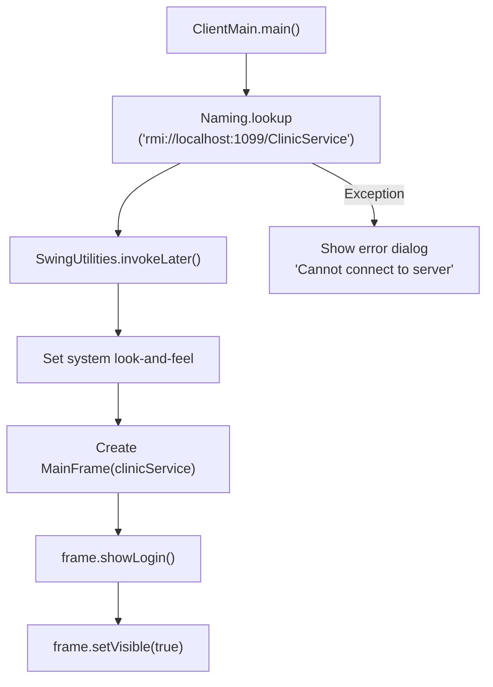

### 4.3 Network Layer

The `net` package defines the **shared contracts** between client and server:

| Class | Type | Role |
|-------|------|------|
| `ClinicService` | `interface extends Remote` | Defines the remote API (3 methods) |
| `ClinicCallback` | `interface extends Remote` | Defines the callback API (1 method) |
| `Request` | `class implements Serializable` | Client → Server request envelope |
| `Response` | `class implements Serializable` | Server → Client response envelope |

**ClinicService Remote Interface:**
```java
public interface ClinicService extends Remote {
    Response processRequest(Request request) throws RemoteException;
    void registerCallback(String userId, ClinicCallback callback) throws RemoteException;
    void unregisterCallback(String userId) throws RemoteException;
}
```

### 4.4 Model Layer

The `model` package contains **7 classes** representing domain entities and result wrappers:

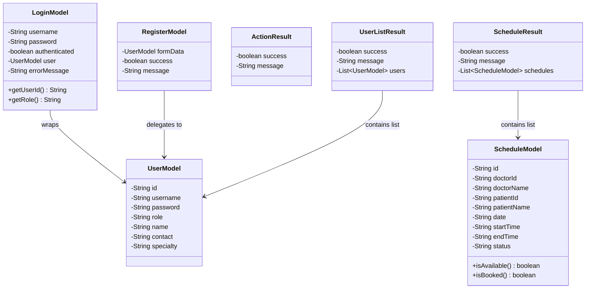

**Model categories:**

| Category | Models | Purpose |
|----------|--------|---------|
| **Domain Entities** | `UserModel`, `ScheduleModel` | Core data structures |
| **Form + Result** | `LoginModel`, `RegisterModel` | Combine form data with operation results |
| **Result Wrappers** | `ActionResult`, `ScheduleResult`, `UserListResult` | Standardized controller return types |

### 4.5 Controller Layer

Controllers sit on the **client side** and serve as intermediaries between Views and the remote ClinicService:

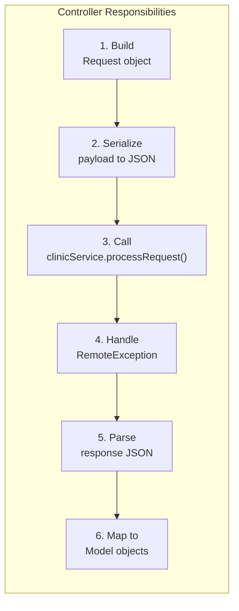

| Controller | Methods | Lines |
|-----------|---------|-------|
| `LoginController` | `login()`, `register()` | 88 |
| `DoctorController` | `createMonthlySchedule()`, `getSchedulesByDoctor()`, `deleteSchedulesByDate()`, `overrideDay()`, `searchAppointments()`, `deleteSlotById()`, `updateSlotTime()`, `validateSlotDeletion()`, `validateSlotTimeUpdate()` | 162 |
| `PatientController` | `getPatientSchedules()`, `getAvailableSlots()`, `bookSlot()`, `cancelBooking()`, `reschedule()`, `getDoctors()` | 171 |

### 4.6 Service Layer

Services run on the **server side** and contain the business logic:

| Service | Responsibility | Key Operations |
|---------|---------------|----------------|
| `AuthService` | Authentication & registration | `login()`, `register()` |
| `ScheduleService` | Schedule management & notifications | 12 methods covering doctor and patient operations |
| `CallbackManager` | Client notification dispatch | `register()`, `unregister()`, `notifyUser()` |
| `ActivityLogger` | Audit trail | `log()`, `printLog()` |

### 4.7 Database Layer

`JsonDatabase` (441 lines) is the sole data access class. It encapsulates all JSON file operations:

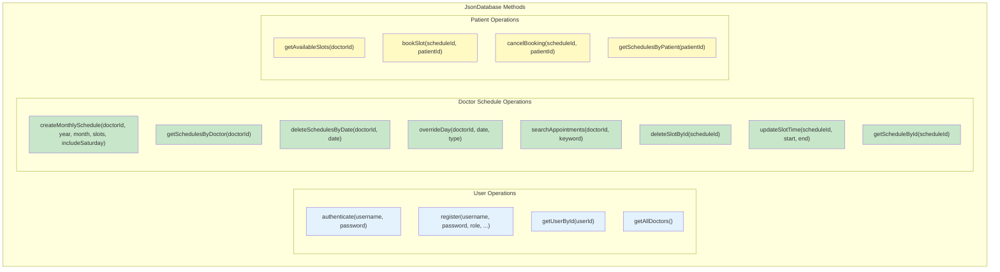

**Implementation details:**
- **Jackson JsonMapper** with `INDENT_OUTPUT` for pretty-printed files
- **Full read → modify → write** pattern for all mutations
- **`loadArray()` / `saveArray()`** helper methods handle file I/O
- **`nodeToUser()` / `nodeToSchedule()`** convert JSON nodes to model objects
- **Duplicate prevention:** `slotExists()` checks before inserting new slots

### 4.8 View Layer

The GUI is built with **Java Swing** using `BorderLayout`, `GridBagLayout`, and `CardLayout`:

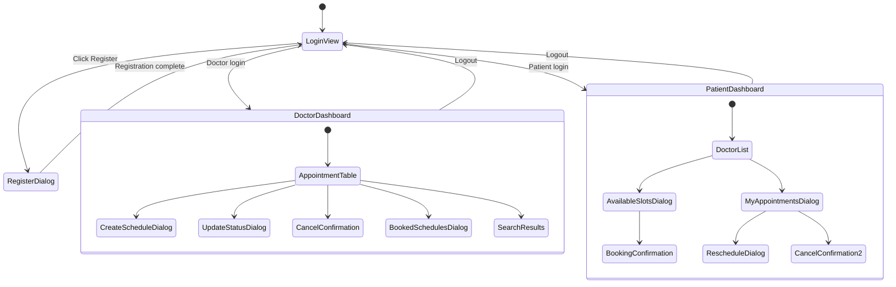

| View | Lines | Key Components |
|------|-------|----------------|
| `MainFrame` | 134 | CardLayout navigation, callback lifecycle management |
| `LoginView` | 371 | Login form, registration dialog, input validation |
| `DoctorView` | 542 | Appointment JTable, search bar, create/update/cancel dialogs, booked schedules sub-dialog |
| `PatientView` | 445 | Doctor JTable, search bar, available slots dialog, my appointments dialog, reschedule flow |
| `NavigationHandler` | 7 | Simple `logout()` interface for decoupling |

### 4.9 Callback System

The callback system enables **server-push notifications** to connected clients:

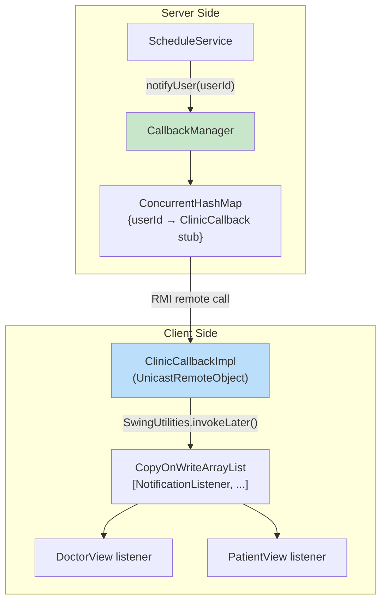

**Lifecycle:**
1. Client logs in → `MainFrame.onLoginSuccess()` creates `ClinicCallbackImpl` and calls `clinicService.registerCallback(userId, callbackImpl)`
2. View registers a `NotificationListener` on the `ClinicCallbackImpl`
3. Server events trigger `CallbackManager.notifyUser(userId, event, message)`
4. `CallbackManager` looks up the user's callback stub and invokes `onNotification()`
5. `ClinicCallbackImpl` dispatches to all registered listeners on the Swing EDT
6. On logout, `MainFrame.logout()` calls `clinicService.unregisterCallback(userId)`
7. If a remote call fails, `CallbackManager` automatically removes the stale callback

### 4.10 Activity Logging

```mermaid
flowchart LR
    A["AuthService / ScheduleService"] -->|"log(user, action, detail)"| B["ActivityLogger"]
    B --> C["Load activity_log.json"]
    C --> D["Append new entry<br/>{timestamp, user, action, detail}"]
    D --> E["Write back to file"]
    F["ServerMain CLI 'log' command"] -->|"printLog()"| B
    B --> G["Format and print entries"]
```

**Logged events include:**
- Server start/stop
- User login (success and failure)
- User registration
- Schedule creation, deletion, override
- Slot booking, cancellation, update, deletion

### 4.11 Request Routing & Action Map

`ClinicServiceImpl.processRequest()` acts as a **front controller**, routing actions via a switch statement:

```mermaid
flowchart TD
    REQ["Request.action"] --> SW{Switch}

    SW -->|"LOGIN"| A1["authService.login()"]
    SW -->|"REGISTER"| A2["authService.register()"]
    SW -->|"CREATE_SCHEDULE"| A3["scheduleService.createSchedule()"]
    SW -->|"READ_SCHEDULES"| A4["scheduleService.readSchedules()"]
    SW -->|"DELETE_SCHEDULE"| A5["scheduleService.deleteSchedule()"]
    SW -->|"OVERRIDE_DAY"| A6["scheduleService.overrideDay()"]
    SW -->|"SEARCH"| A7["scheduleService.searchAppointments()"]
    SW -->|"DELETE_SLOT"| A8["scheduleService.deleteSlot()"]
    SW -->|"UPDATE_SLOT"| A9["scheduleService.updateSlot()"]
    SW -->|"GET_AVAILABLE_SLOTS"| A10["scheduleService.getAvailableSlots()"]
    SW -->|"BOOK_SLOT"| A11["scheduleService.bookSlot()"]
    SW -->|"CANCEL_BOOKING"| A12["scheduleService.cancelBooking()"]
    SW -->|"GET_PATIENT_SCHEDULES"| A13["scheduleService.getPatientSchedules()"]
    SW -->|"GET_DOCTORS"| A14["scheduleService.getDoctors()"]
    SW -->|"default"| A15["Error 400: Unknown action"]

    style A1 fill:#e3f2fd
    style A2 fill:#e3f2fd
    style A3 fill:#c8e6c9
    style A4 fill:#c8e6c9
    style A5 fill:#c8e6c9
    style A6 fill:#c8e6c9
    style A7 fill:#c8e6c9
    style A8 fill:#c8e6c9
    style A9 fill:#c8e6c9
    style A10 fill:#fff9c4
    style A11 fill:#fff9c4
    style A12 fill:#fff9c4
    style A13 fill:#fff9c4
    style A14 fill:#fff9c4
    style A15 fill:#ffcdd2
```

### 4.12 JSON Serialization Strategy

The codebase uses **Jackson 3.1.0** (`tools.jackson.core:jackson-databind`) for all JSON operations:

| Layer | Usage | Pattern |
|-------|-------|---------|
| **Controllers** (client) | Serialize request payloads, parse response data | `ObjectMapper.writeValueAsString()` / `readTree()` |
| **Services** (server) | Parse request payloads, serialize response data | `ObjectMapper.readTree()` / `writeValueAsString()` |
| **JsonDatabase** | Read/write JSON files | `ObjectMapper.readTree(File)` / `writeValue(File, ...)` |
| **ActivityLogger** | Append to log file | `ArrayNode` manipulation + `writeValue()` |

**Key note:** JSON is used in **two distinct ways**:
1. **As RMI payload** — JSON strings inside `Request.payload` and `Response.data` fields
2. **As file format** — Direct file I/O for persistent storage

---

## 5. Data Flow Analysis

### 5.1 Login Flow

```mermaid
sequenceDiagram
    actor User
    participant LV as LoginView
    participant LC as LoginController
    participant CS as ClinicService (RMI)
    participant IMPL as ClinicServiceImpl
    participant AS as AuthService
    participant DB as JsonDatabase
    participant MF as MainFrame

    User->>LV: Enter username + password
    User->>LV: Click "Login"
    LV->>LV: Validate non-empty fields
    LV->>LC: login(username, password)
    LC->>LC: Build Request(action=LOGIN, payload={username, password})
    LC->>CS: processRequest(request)
    CS->>IMPL: processRequest(request)
    IMPL->>AS: login(request)
    AS->>AS: parsePayload(json) → {username, password}
    AS->>DB: authenticate(username, password)
    DB->>DB: Load users.json, scan for match
    alt Found
        DB-->>AS: UserModel
        AS->>AS: Build response data JSON with user profile
        AS-->>IMPL: Response(success, 200, data)
    else Not Found
        DB-->>AS: null
        AS-->>IMPL: Response(error, 401, "Invalid credentials")
    end
    IMPL-->>CS: Response
    CS-->>LC: Response
    LC->>LC: Parse data JSON → UserModel → LoginModel
    LC-->>LV: LoginModel
    alt Authenticated
        LV->>MF: onLoginSuccess(model)
        MF->>MF: Register callback
        MF->>MF: Show Doctor/Patient dashboard
    else Failed
        LV->>LV: Show error dialog
    end
```

### 5.2 Booking Flow

```mermaid
sequenceDiagram
    actor Patient
    participant PV as PatientView
    participant PC as PatientController
    participant CS as ClinicService (RMI)
    participant SS as ScheduleService
    participant DB as JsonDatabase
    participant CBM as CallbackManager
    participant DoctorCB as Doctor's Callback

    Patient->>PV: Select doctor → View Slots
    PV->>PC: getAvailableSlots(doctorId)
    PC->>CS: processRequest(GET_AVAILABLE_SLOTS)
    CS->>SS: getAvailableSlots(request)
    SS->>DB: getAvailableSlots(doctorId)
    DB-->>SS: List<ScheduleModel>
    SS-->>CS: Response(success, slots JSON)
    CS-->>PC: Response
    PC-->>PV: ScheduleResult

    PV->>PV: Show slots dialog
    Patient->>PV: Select slot → Click "Book Selected"
    Patient->>PV: Confirm booking

    PV->>PC: bookSlot(patientId, scheduleId)
    PC->>CS: processRequest(BOOK_SLOT)
    CS->>SS: bookSlot(request)
    SS->>DB: getScheduleById(scheduleId)
    DB-->>SS: ScheduleModel (with doctorId)
    SS->>DB: bookSlot(scheduleId, patientId)
    DB->>DB: Set status=Booked, patientId=patientId
    DB-->>SS: true

    SS->>CBM: notifyUser(doctorId, "SLOT_BOOKED", message)
    CBM->>DoctorCB: onNotification("SLOT_BOOKED", message)

    SS-->>CS: Response(success, "Appointment booked!")
    CS-->>PC: Response
    PC-->>PV: ActionResult(success)
    PV->>PV: Remove booked row from slot table
```

### 5.3 Schedule Creation Flow

```mermaid
sequenceDiagram
    actor Doctor
    participant DV as DoctorView
    participant DC as DoctorController
    participant CS as ClinicService (RMI)
    participant SS as ScheduleService
    participant DB as JsonDatabase

    Doctor->>DV: Click "Create Schedule"
    DV->>DV: Show dialog (year, month, time slots, Saturday checkbox)
    Doctor->>DV: Configure and click OK
    DV->>DV: Validate: not past month, ≥1 slot selected

    DV->>DC: createMonthlySchedule(doctorId, year, month, slots, includeSaturday)
    DC->>DC: Build Request with JSON payload
    DC->>CS: processRequest(CREATE_SCHEDULE)
    CS->>SS: createSchedule(request)
    SS->>SS: Parse payload and extract slots array
    SS->>DB: createMonthlySchedule(doctorId, year, month, slots, includeSaturday)

    DB->>DB: Load schedules.json
    loop Each day in month
        DB->>DB: Skip Sundays
        DB->>DB: Skip Saturdays (unless included)
        loop Each time slot
            DB->>DB: Check: slotExists(doctorId, date, startTime)?
            alt Not exists
                DB->>DB: Create SCH-{UUID} entry with status "Available"
            end
        end
    end
    DB->>DB: Save schedules.json
    DB-->>SS: count of created slots

    SS-->>CS: Response(success, "Created N schedule slots")
    CS-->>DC: Response
    DC-->>DV: ActionResult(success)
    DV->>DV: Show confirmation + refresh table
```

### 5.4 Cancellation Flow

```mermaid
sequenceDiagram
    actor Patient
    participant PV as PatientView
    participant PC as PatientController
    participant CS as ClinicService (RMI)
    participant SS as ScheduleService
    participant DB as JsonDatabase
    participant CBM as CallbackManager
    participant DoctorCB as Doctor's Callback

    Patient->>PV: My Appointments → Select → Cancel
    Patient->>PV: Confirm cancellation
    PV->>PC: cancelBooking(patientId, scheduleId)
    PC->>CS: processRequest(CANCEL_BOOKING)
    CS->>SS: cancelBooking(request)
    SS->>DB: getScheduleById(scheduleId)
    DB-->>SS: ScheduleModel (with doctorId)
    SS->>DB: cancelBooking(scheduleId, patientId)
    DB->>DB: Verify status=Booked and patientId matches
    DB->>DB: Set status=Available, patientId=""
    DB-->>SS: true

    SS->>CBM: notifyUser(doctorId, "BOOKING_CANCELLED", message)
    CBM->>DoctorCB: onNotification("BOOKING_CANCELLED", message)

    SS-->>CS: Response(success)
    CS-->>PC: Response
    PC-->>PV: ActionResult(success)
    PV->>PV: Refresh appointment list
```

### 5.5 Reschedule Flow

```mermaid
sequenceDiagram
    actor Patient
    participant PV as PatientView
    participant PC as PatientController
    participant CS as ClinicService (RMI)

    Patient->>PV: My Appointments → Select → Reschedule
    PV->>PC: getAvailableSlots(doctorId)
    PC-->>PV: ScheduleResult (available slots)
    PV->>PV: Show slot picker dialog
    Patient->>PV: Select new slot

    PV->>PC: reschedule(patientId, oldScheduleId, newScheduleId)

    Note over PC: Step 1: Cancel old booking
    PC->>CS: processRequest(CANCEL_BOOKING, oldScheduleId)
    CS-->>PC: Response(success)

    Note over PC: Step 2: Book new slot
    PC->>CS: processRequest(BOOK_SLOT, newScheduleId)
    alt Success
        CS-->>PC: Response(success)
        PC-->>PV: ActionResult(success, "Rescheduled!")
    else Failure
        CS-->>PC: Response(error)
        Note over PC: Rollback: Re-book old slot
        PC->>CS: processRequest(BOOK_SLOT, oldScheduleId)
        PC-->>PV: ActionResult(failure)
    end
```

---

## 6. Data Model & Storage

### 6.1 Entity Relationship Diagram

```mermaid
erDiagram
    USER {
        string id PK "DOC-XXXXXXXX or PAT-XXXXXXXX"
        string username UK "Unique login name"
        string password "Plain text"
        string role "doctor | patient"
        string name "Full name"
        string contact "Phone/email"
        string specialty "Doctors only"
    }

    SCHEDULE {
        string id PK "SCH-XXXXXXXX"
        string doctorId FK "References USER.id"
        string date "yyyy-MM-dd"
        string startTime "HH:mm"
        string endTime "HH:mm"
        string status "Available | Booked"
        string patientId FK "References USER.id (when booked)"
    }

    ACTIVITY_LOG {
        string timestamp "yyyy-MM-dd HH:mm:ss"
        string user "User ID or SERVER"
        string action "Event type"
        string detail "Description"
    }

    USER ||--o{ SCHEDULE : "doctor creates"
    USER ||--o{ SCHEDULE : "patient books"
    USER ||--o{ ACTIVITY_LOG : "generates"
```

### 6.2 JSON Schema Definitions

#### User Object
```json
{
  "id": "DOC-7482E551",
  "username": "Yuri",
  "password": "1111",
  "role": "doctor",
  "name": "Yuri",
  "contact": "09123456789",
  "specialty": "Neuro"
}
```

#### Schedule Object
```json
{
  "id": "SCH-74BF5414",
  "doctorId": "DOC-7482E551",
  "date": "2026-03-02",
  "startTime": "08:00",
  "endTime": "09:00",
  "status": "Booked",
  "patientId": "PAT-6A9D3EFC"
}
```

#### Activity Log Entry
```json
{
  "timestamp": "2026-03-12 10:30:00",
  "user": "PAT-6A9D3EFC",
  "action": "BOOK_SLOT",
  "detail": "Booked slot SCH-74BF5414"
}
```

### 6.3 Data File Inventory

| File | Location | Contents | Records |
|------|----------|----------|---------|
| `users.json` | `src/main/resources/` | All registered users (doctors + patients) | 6 users |
| `schedules.json` | `src/main/resources/` | All schedule slots | 300+ slots |
| `activity_log.json` | `src/main/resources/` | Audit trail of all events | 200+ entries |

**ID Generation Scheme:**

| Entity | Prefix | Format | Example |
|--------|--------|--------|---------|
| Doctor | `DOC-` | `DOC-` + 8 chars UUID | `DOC-7482E551` |
| Patient | `PAT-` | `PAT-` + 8 chars UUID | `PAT-6A9D3EFC` |
| Schedule | `SCH-` | `SCH-` + 8 chars UUID | `SCH-74BF5414` |

---

## 7. API & Protocol Reference

### 7.1 RMI Interface Contract

```mermaid
classDiagram
    class ClinicService {
        <<interface>>
        <<Remote>>
        +processRequest(Request) Response
        +registerCallback(String userId, ClinicCallback callback) void
        +unregisterCallback(String userId) void
    }

    class ClinicCallback {
        <<interface>>
        <<Remote>>
        +onNotification(String eventType, String message) void
    }

    class Request {
        <<Serializable>>
        -String action
        -String entity
        -String userId
        -String payload
    }

    class Response {
        <<Serializable>>
        -String status
        -int code
        -String message
        -String data
    }

    ClinicService ..> Request : accepts
    ClinicService ..> Response : returns
    ClinicService ..> ClinicCallback : manages
```

### 7.2 Action Catalog

| Action | Entity | Actor | Payload Fields | Response Data | Service Method |
|--------|--------|-------|----------------|---------------|----------------|
| `LOGIN` | `user` | All | `username`, `password` | User JSON | `AuthService.login()` |
| `REGISTER` | `user` | All | `username`, `password`, `role`, `name`, `contact`, `specialty?` | — | `AuthService.register()` |
| `CREATE_SCHEDULE` | `schedule` | Doctor | `doctorId`, `year`, `month`, `includeSaturday`, `slots[]` | — | `ScheduleService.createSchedule()` |
| `READ_SCHEDULES` | `schedule` | Doctor | `doctorId` | Schedule[] JSON | `ScheduleService.readSchedules()` |
| `DELETE_SCHEDULE` | `schedule` | Doctor | `doctorId`, `date` | — | `ScheduleService.deleteSchedule()` |
| `OVERRIDE_DAY` | `schedule` | Doctor | `doctorId`, `date`, `type` (halfday\|offday) | — | `ScheduleService.overrideDay()` |
| `SEARCH` | `schedule` | Doctor | `doctorId`, `keyword` | Schedule[] JSON | `ScheduleService.searchAppointments()` |
| `DELETE_SLOT` | `schedule` | Doctor | `scheduleId` | — | `ScheduleService.deleteSlot()` |
| `UPDATE_SLOT` | `schedule` | Doctor | `scheduleId`, `startTime`, `endTime` | — | `ScheduleService.updateSlot()` |
| `GET_AVAILABLE_SLOTS` | `schedule` | Patient | `doctorId?` | Schedule[] JSON | `ScheduleService.getAvailableSlots()` |
| `BOOK_SLOT` | `schedule` | Patient | `scheduleId`, `patientId` | — | `ScheduleService.bookSlot()` |
| `CANCEL_BOOKING` | `schedule` | Patient | `scheduleId`, `patientId` | — | `ScheduleService.cancelBooking()` |
| `GET_PATIENT_SCHEDULES` | `schedule` | Patient | `patientId` | Schedule[] JSON | `ScheduleService.getPatientSchedules()` |
| `GET_DOCTORS` | `user` | Patient | — | User[] JSON | `ScheduleService.getDoctors()` |

### 7.3 Response Code Semantics

| Code | Status | Meaning | Used By |
|------|--------|---------|---------|
| `200` | `success` | Operation successful | All success responses |
| `201` | `success` | Resource created | `AuthService.register()` |
| `400` | `error` | Bad request / missing parameters | All services (validation) |
| `401` | `error` | Authentication failed | `AuthService.login()` |
| `404` | `error` | Resource not found | `deleteSlot()`, `updateSlot()`, `cancelBooking()` |
| `409` | `error` | Conflict (duplicate/unavailable) | `register()` (username taken), `bookSlot()` (already booked) |
| `500` | `error` | Communication failure | Controllers (RMI RemoteException) |

---

## 8. Evolution History

The codebase has undergone **three major migrations**, documented in the repository:

```mermaid
timeline
    title Project Evolution
    section Phase 1 : Original Implementation
        TCP Sockets : Socket-based client-server
        XML Database : XML files with custom parsers
        No Callbacks : Polling for updates
    section Phase 2 : Socket to RMI Migration
        Java RMI : Replaced TCP sockets
        Request/Response : Made Serializable
        ClinicService : Created Remote interface
        Port Change : 9090 → 1099
        Deleted : SocketClient, ClientHandler, ProtocolUtils
    section Phase 3 : XML to JSON Migration
        Jackson 3.1.0 : Replaced XML parsers
        JsonDatabase : Replaced XMLDatabase
        JSON files : users.json, schedules.json, activity_log.json
        Deleted : XMLDatabase, XMLModelParser, SimpleXMLParser
    section Phase 4 : Callback Implementation
        ClinicCallback : Remote callback interface
        ClinicCallbackImpl : Client-side receiver
        CallbackManager : Server-side registry
        Real-time : Push notifications
        Events : SLOT_BOOKED, CANCELLED, UPDATED, DELETED
```

| Migration | From | To | Key Changes |
|-----------|------|-----|-------------|
| **Socket → RMI** | TCP sockets on port 9090 | Java RMI on port 1099 | Created `ClinicService` remote interface, deleted `SocketClient`, `ClientHandler`, `ProtocolUtils` |
| **XML → JSON** | Custom XML parsers | Jackson 3.1.0 | Created `JsonDatabase`, deleted `XMLDatabase`, `XMLModelParser`, `SimpleXMLParser`; new dependency in POM |
| **Callback System** | No real-time updates | RMI callbacks | Created `ClinicCallback`, `ClinicCallbackImpl`, `CallbackManager`; added 4 notification event types |

---

## 9. Quality Assessment

### 9.1 Strengths

| Area | Assessment |
|------|-----------|
| **Clean Architecture** | Well-defined MVC layers with clear separation of concerns |
| **Consistent Patterns** | All controllers follow the same Request → RMI → Response → Model pattern |
| **Thread Safety** | `synchronized` methods, `ConcurrentHashMap`, `CopyOnWriteArrayList`, EDT dispatch |
| **Error Handling** | Controllers wrap `RemoteException` into user-friendly error responses |
| **Business Rule Enforcement** | Validation at both controller and database levels |
| **Atomic Operations** | Reschedule has rollback logic if the new booking fails |
| **Real-Time Updates** | RMI callbacks with automatic stale-client cleanup |
| **Audit Trail** | Comprehensive activity logging with timestamps |
| **Well-Documented Evolution** | Three detailed migration documents in the repository |
| **Status Validation** | `ScheduleModel.setStatus()` throws on invalid values |

### 9.2 Areas for Improvement

| Area | Current State | Recommendation |
|------|--------------|----------------|
| **Password Storage** | Plain text in `users.json` | Hash with bcrypt/scrypt before storing |
| **Session Management** | No session tokens or expiry | Implement session tokens with TTL |
| **Input Validation** | Minimal (non-empty checks) | Add format validation for times, dates, emails |
| **Test Coverage** | No test files found | Add JUnit tests for services and database |
| **Error Propagation** | Stack traces printed to stderr | Use structured logging (e.g., SLF4J) |
| **Database Scalability** | Full file read/write per operation | Consider embedded DB (SQLite/H2) for larger datasets |
| **Configuration** | Hardcoded port (1099) and data directory | Externalize to properties file |
| **Model Mapping** | Manual JSON ↔ Model conversion | Use Jackson's `ObjectMapper.readValue(json, Class)` |
| **UI Responsiveness** | RMI calls on EDT could block | Use `SwingWorker` for network operations |
| **Resource Cleanup** | No `dispose()` on replaced panels | Implement proper panel lifecycle management |

### 9.3 Security Considerations

| Risk | Severity | Details |
|------|----------|---------|
| **Plain-text Passwords** | Critical | Passwords stored unencrypted in `users.json` |
| **No Authorization** | High | Any authenticated user can access any action — no role-based access control on the server side |
| **No Input Sanitization** | Medium | JSON payloads are parsed but values aren't sanitized |
| **No Transport Security** | Medium | RMI communication is unencrypted |
| **No Rate Limiting** | Low | No protection against brute-force login attempts |
| **Predictable IDs** | Low | UUID-based but only 8 characters (collisions possible at scale) |

---

## 10. Metrics & Statistics

### Codebase Metrics

| Metric | Value |
|--------|-------|
| **Total Java Source Files** | 24 |
| **Total Lines of Java Code** | ~3,500+ |
| **Total JSON Data Files** | 3 |
| **Total Documentation Files** | 3 |
| **RMI Actions Supported** | 14 |
| **Notification Event Types** | 4 |
| **Model Classes** | 7 |
| **View Classes** | 4 (+ 1 interface) |
| **Controller Classes** | 3 |
| **Service Classes** | 4 (AuthService, ScheduleService, CallbackManager, ActivityLogger) |
| **External Dependencies** | 1 (Jackson 3.1.0) |

### File Size Distribution

| File | Package | Lines | Category |
|------|---------|-------|----------|
| `DoctorView.java` | view | 542 | Largest — complex UI |
| `PatientView.java` | view | 445 | Second largest — patient UI |
| `JsonDatabase.java` | database | 441 | Data access layer |
| `LoginView.java` | view | 371 | Login + registration UI |
| `ScheduleService.java` | server | 294 | Schedule business logic |
| `PatientController.java` | controller | 171 | Patient request handling |
| `DoctorController.java` | controller | 162 | Doctor request handling |
| `ScheduleModel.java` | model | 162 | Domain entity |
| `MainFrame.java` | (default) | 134 | Application frame |
| `ServerMain.java` | server | 112 | Server entry point |
| `AuthService.java` | server | 107 | Auth business logic |
| `ActivityLogger.java` | server | 95 | Audit logger |
| `LoginController.java` | controller | 88 | Auth request handling |
| `ClinicServiceImpl.java` | server | 62 | Request router |
| `UserModel.java` | model | 60 | User entity |
| `RegisterModel.java` | model | 55 | Registration model |
| `LoginModel.java` | model | 53 | Login model |
| `ClinicCallbackImpl.java` | client | 44 | Callback receiver |
| `CallbackManager.java` | server | 41 | Callback registry |
| `ClientMain.java` | client | 27 | Client entry point |
| `Request.java` | net | 22 | Request DTO |
| `Response.java` | net | 22 | Response DTO |
| `ClinicCallback.java` | net | 22 | Callback interface |
| `ClinicService.java` | net | 42 | Service interface |
| `ScheduleResult.java` | model | 20 | Result wrapper |
| `UserListResult.java` | model | 20 | Result wrapper |
| `ActionResult.java` | model | 16 | Result wrapper |
| `NavigationHandler.java` | view | 7 | Nav interface |

### Architecture Ratios

```mermaid
pie title Lines of Code by Layer
    "View (Presentation)" : 1499
    "Server (Services)" : 711
    "Database (Data Access)" : 536
    "Controller" : 421
    "Model" : 386
    "Net (Protocol)" : 108
    "Client (Entry)" : 71
```

---

## 11. Glossary

| Term | Definition |
|------|-----------|
| **RMI** | Remote Method Invocation — Java's built-in mechanism for calling methods on objects in other JVMs |
| **Callback** | A server-initiated RMI call to a client-registered remote object for push notifications |
| **EDT** | Event Dispatch Thread — Swing's single thread for all GUI operations |
| **Slot** | A single bookable time window in a doctor's schedule (e.g., 08:00–09:00) |
| **DTO** | Data Transfer Object — `Request` and `Response` serve as DTOs between client and server |
| **Action** | A string identifier (e.g., `LOGIN`, `BOOK_SLOT`) that determines which server method to invoke |
| **Payload** | JSON-encoded string carried inside a `Request` or `Response` for flexible parameter passing |
| **Override** | A schedule modification that removes available slots for a date (half-day or off-day) |
| **Front Controller** | `ClinicServiceImpl` acts as a single entry point routing all requests to appropriate handlers |
| **Stale Callback** | A callback reference to a client that has disconnected — automatically cleaned up on `RemoteException` |
| **CardLayout** | Swing layout manager used by `MainFrame` to switch between login and dashboard views |

---

*This document was generated through comprehensive analysis of all 24 Java source files, 3 JSON data files, 3 migration documents, and the Maven build configuration in the WellnessLink repository.*
